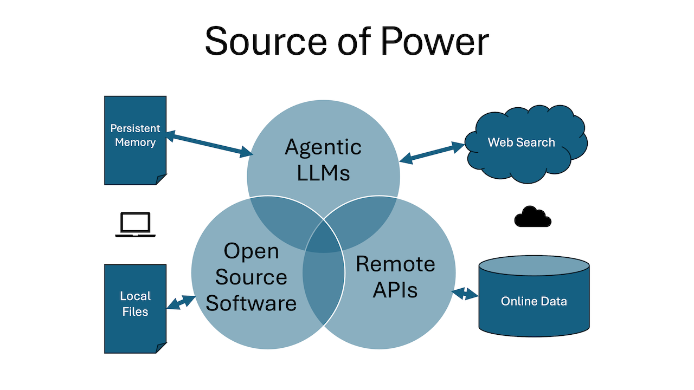

# Has AI Changed the Meaning of Intelligence?

Ask me about the "I" in "AI" five years ago, or twenty-five years ago, and I would quote John McCarthy that, "As soon as it works, no one calls it AI anymore." 

Computers recognising text, faces, and objects from images once seemed impossible. Along came the right mathematics and training data, and now it is commonplace. Yet those of us who understand the maths and data involved know it is a completely different route to achieving some things humans also do. The mystique evaporates the moment we pull back the curtain.

It also is true that there is some degree to which "Artificial Intelligence" remains one of the most captivating marketing slogans of our time, ironically applied to a joint venture between two institutions that most people find notoriously unsexy: statistics and computer science. Partly, this is because it strikes at the heart of some fundamental collective human anxieties, which I will touch on in another piece.

Yet for all the ways in which this technology functions through a compelling metaphor, it also works. 

In the past few months, in the software industry, it has started working spookily well thanks to AI agents like Claude Code.

As a programmer, when I tell Claude Code to create a software feature, it shows its workings out along the way as it alternates between running commands and evaluating their results. I watch it "think" at different horizons (strategic, tactical, analytical) in a way that resembles my own inner monologue when completing a similar task.

### Where Agents Get Their Power

This has become possible due to the convergence of three vast areas of human activity, each more than thirty years in the making.

LLMs are a dense compression of vast outputs of human expression (mostly taken from the internet) into a system of pattern recognition and completion. APIs are a means to talk to an array of existing software services online, developed initially to serve mobile phones, now used to automate many tasks. And open source tools, particularly command-line tools that process text, such as a fifty-year-old workhorse search-and-replace tool called "awk", are the eyes, ears, and hands of AI Agents.

You see, LLMs have not only learned patterns, but memorised every manual and specification for these online services and on-disk tools. What programmers could spend half their day Googling to understand how to unlock the power of a specific pre-built feature, LLMs access in milliseconds.

Plus, what computers can do once, they can do rapidly and repeatedly without breaking a sweat. As a result, the recursive completion of acquired patterns, both to evaluate the results of using tools and to initiate new tool use, resembles the way programmers solve real-world tasks, but at a tireless breakneck speed.

So is this intelligence, or just more mimicry sped up?

### Fooling Humans is Easy

The theoretical pinnacle of AI research used to be the Turing test. We once dreamed that a chat bot responding to a person would become indistinguishable from a human typing at a keyboard. As I mentioned in a [previous piece](https://www.robertpeake.com/archives/103746-what-ai-taught-me-about-being-human.html), we crossed that threshold in the '60s with a little programme called Eliza. It was programmed to ask open-ended questions in a mimicry of listening, which still comes across as more human than early versions of know-it-all ChatGPT.

So, it turns out, mimicking humans was never the hard part of AI. It is producing results that matter to humans. Yet AI does so, perforce, by mimicking us. And that makes it harder to classify.

### Not What, But Where is Intelligence?

Unlike previous technologies that functioned as tools, AI feels like a "third thing", not quite "us" but not quite "tool". It not only mirrors our thinking, but helps us think as we interact with it, and carries out our wishes with increasing success. This co-thinking and co-working is sometimes described in relation to Daniel Kahneman's "two systems" of human thought (fast and slow) as "system three" (artificial).

In his eponymous movie, Forrest Gump famously defends against critics of his low IQ score by pointing out that, "stupid is as stupid does". Conversely, if we think of intelligence not as a possession but a behaviour, the question then becomes not "is AI intelligent", but "where is AI most intelligent"?

The shift from AI exhibiting behaviour we thought only we could do, to participating with us as a thinking partner, to now doing thinking work faster and better than us with our supervision, would seem to set a trajectory toward it becoming ever-more like us, eventually surpassing us to become god-like.

Adam Smith's invisible hand, which nudges markets based on supply and demand, is another form of intelligence that is more about God than human appendages. By contrast, I think of AI agents more like the pantheon of Hinduism, where divine alacrity is represented by a blur of innumerable moving hands. Yet for all their power, AI agents are also like the buddha, desireless. That part, we still supply.

### Where Is All This Going?

It is tempting to extrapolate from gains in software development to predictions of gains across all forms of knowledge work. Efforts are now underway to make "world models" by gathering visual data from human activity, strapping cameras to people's heads so computers can watch them fold towels. But unlike the pride-incentivised outputs of internet forums and open source software contributions, these methods are costly and slow.

Lacking the vast training data and toolset of the software industry, we might instead surmise that AI can train itself on tasks besides programming, as it did to become unbeatable in chess.

However, unlike chess, where the rules are well-defined, any work that blends in an element of art suddenly becomes as much about [breaking the rules as obeying them](https://www.robertpeake.com/archives/103816-the-infinite-game-of-poetry.html). Absent a quantifiable definition of success, there can be no automated training. There will never be a compiler that can check for bugs in your poem. And a surprising amount of knowledge work is sprinkled with bits of poetry.

Yet we humans seamlessly navigate these nearly-boundless domains, and their ambiguous quasi-poetic contexts, while simultaneously attending to our own portable internal telescoping worlds of self-awareness and thought, brains and bodies powered by a tiny fraction of the energy it takes for a frontier-model LLM to say, "Hello, world".

### What about AGI?

Some cite emergence theory as the explanation that our own sentience ultimately developed out of primordial soup, due to its evolving complexity. It is unnerving to think that emergence within undeniably complex AI systems might likewise coalesce into self-awareness.

The problem with emergence is that it is entangled with anthropomorphism such that we never know if we are recognising independent intelligence, or projecting intelligence onto something simply because it resembles the behaviour of (intelligent) us. 

If a cloud looks like a face, and a computer recognises it as a face, is this intelligence simply because it is something we also do? Or do we fix the computer bug with more training data, and accept the evolutionary bug as a source of whimsy that makes us unique?

Either way, as AI progresses it will continue to exhibit behaviours we deem both smart and stupid, as these are in the eye of the beholder. Rather than cataloguing our respective strengths and deficits into an us-versus-them league table, we are better served by thinking about what it means for both of us to inhabit a far greater "system three" intelligence together.

### The Wisdom of Protocols

B.F. Skinner quipped that, "the real problem is not whether machines think but whether men do." Although it was intended to dismiss the question of machine intelligence as secondary to human concerns, fifty years on, it reads more like an indictment of humans as the weakest link in the third system loop. Perhaps that is the price AI must pay for us giving it a reason to exist.

AI, used well, turbo-charges our capabilities within an intellectual domain. This comes with its own problems for us in the form of immediate-term cognitive load, and longer-term cognitive debt. What are we delegating, what are we retaining, and what are we quietly losing the capacity to work out on our own?  Learning to navigate this "third system" or "transhuman" reality is where real wisdom will lie.

All of us is smarter than any one of us, but only if we can work together.

Patterns for coordinating intelligent human behaviour, such as Agile, KANBAN, and GTD, are already showing great promise for enhancing human-AI effectiveness in a way that remains humane. While habits, rituals, and ceremonies are the domain of humans alone, protocols are the superset that encompass both person and machine. 

I believe that the future belongs to articulate generalists who can check their own assumptions and validate results. For the rest of us, there are protocols to be dusted off, discovered, and adapted to bolster our collective intelligence while retaining the wisdom, creativity, and self-awareness that makes us, as a species, who we are.
