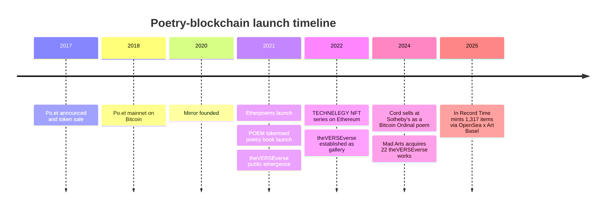
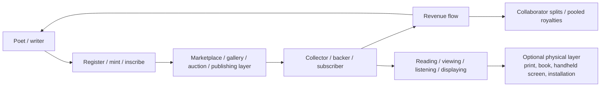

# Poetry and the Blockchain

## Methodology and data sources

This review focuses on documented precedents rather than every poetic NFT drop. I selected projects that met three tests: they made an explicit attempt to combine poetry or literary writing with blockchain; they left enough primary documentation to reconstruct their design; and they produced at least some public evidence of adoption, market activity, institutional uptake, or critical debate. That yields a deliberately mixed sample: a rights-and-licensing registry, a publishing infrastructure layer, a fully on-chain poetry collective, a curated poetry gallery, a tokenised poetry book, an artist-led generative poetry programme, and a prestige auction/inscription case.

Primary evidence came from official project sites, whitepapers and lightpapers, official marketplace or auction listings, code or technical documentation where available, and partner or institutional announcements. Secondary evidence was used mainly for reception, context, and when primary documentation was thin. Where sales, holder counts, grants, or follower counts were only visible on live marketplace or social pages, I treat them as point-in-time snapshots current to this review. Where public metrics were not disclosed, I mark them as **unspecified**.

## Executive summary

The clearest pattern is that **registry-first** and **finance-first** literary blockchain models struggled, while **art-object**, **performance**, and **curation-led** poetry models proved more durable. urlPo.ethttps://po.et built an ambitious attribution and licensing stack for creative works, but the surviving record ends in scaling problems and absorption into another media-chain effort. urlPOEMturn40search2 proposed a tokenised poetry book with AMM-driven scarcity and physical redemption, but the public record offers little evidence of broad literary uptake. By contrast, urlEtherpoemsturn34view0, urltheVERSEverseturn20search7, urlTECHNELEGYturn42view0, and urlCordturn3search15 succeeded when the poem became a collectible, performative, or institutionally mediated artwork rather than a mere rights entry in a database. citeturn16view0turn37view0turn34view0turn20search7turn42view0turn3search15

The most durable enabling layer was not poetry-specific at all but urlMirrorturn26search6. Mirror gave writers wallet-based identity, decentralised storage, crowdfunds, editions, revenue splits, and later subscription-style tools. Its significance for poetry is infrastructural: it normalised the idea that writing could be financed, collected, and redistributed on-chain even when the most visible early use cases were essays, newsletters, DAOs, and cultural projects rather than poems. citeturn24view0turn25search4turn29view0

Governance across the sample was usually **foundation-led, curator-led, or artist-led**, not genuinely decentralised. Legal/IP design was often the weakest-documented layer: only Po.et squarely centred licensing architecture; POEM clearly tied the token to access and physical redemption; most NFT-poetry projects relied on standard art-market assumptions, leaving copyright transfer either untouched or publicly unspecified. The strongest verifiable successes therefore sit in a niche but real band of outcomes: Po.et’s roughly $10m ICO; Mirror’s very large publishing community; Etherpoems’ tens of ETH in traded volume; theVERSEverse’s museum acquisition, public installations, and institutional partnerships; TECHNELEGY’s gallery and marketplace sales; and Cord’s landmark Sotheby’s sale. Yet scepticism around NFTs’ speculative logic and, later, around AI-mediated authorship, remained integral to the field’s reception. citeturn45search3turn27search2turn29view0turn34view0turn3search2turn42view0turn3search17turn46search6turn46search0

## Project analyses

### urlPo.ethttps://po.et

**Main proposition and implementation.** Po.et launched in 2017 to create “an open, universal, and immutable ledger” for ownership, attribution, discovery, and licensing of creative works. Its design split the stack across two chains and off-chain distribution: creative-work claims were timestamped on the entity["cryptocurrency","Bitcoin","blockchain network"] blockchain through OP_RETURN transactions, while work hashes and metadata were distributed via BitTorrent and the Kademlia DHT; the POE token itself was an ERC-20 on entity["cryptocurrency","Ethereum","blockchain network"]. Public documentation described a fairly serious node architecture: ClaimSet Creator, Torrent Service, Bitcoin Scanner, Claim Processor, Trusted Claim System, and a copyright-domain subsystem communicating through RabbitMQ and REST APIs. Its literary proposition was not “sell poems as art” but “make digital writing licensable, searchable, and provable at scale.” citeturn18view0turn15view0turn15view1

**Governance, funding, UX, IP, outcomes, reception, assessment.** Governance sat with a Singapore-based foundation governed by a five-to-ten-member board; code was to be MIT-licensed. Tokenomics were conventional for the ICO era: 50% to the public sale, 10% to early investors, 10% to ecosystem contributors, 22% to the foundation, and 8% to team/founders. The official sale announcement said Po.et had already raised $1m in a pre-sale and was aiming for a further $9m; later ICO tracking recorded a $10m main sale. On the user side, creators could register individual works manually, or via planned CMS and social integrations; publishers were meant to search, certify, and license them. Legally, Po.et was strongest of the sample: it explicitly modelled claims, certifications, revocations, and offers/licensing, while also stating POE should **not** be construed as a profit-sharing security. Public community metrics are thin in surviving official materials beyond the Medium blog’s 1.96k followers. The measurable arc is stark: mainnet launched in 2018, but by 2020 Po.et’s own merger announcement said the project had hit scaling, storage, and transaction-fee problems and was being absorbed into a separate sidechain ecosystem. On evidence, Po.et was an influential **technical precedent** but a weak long-term poetry market. citeturn45search6turn45search3turn18view0turn17search0turn16view0

### urlMirrorturn26search6

**Main proposition and implementation.** Mirror, founded at the end of 2020, did not target poetry alone. Its proposition was broader: give writers web3-native publishing infrastructure so that writing could carry identity, funding, collectability, and payouts inside the same stack. Technically, Mirror paired decentralised identity through ENS with decentralised content storage on Arweave; posts were signed by the author’s key and stored as digests. Around that core, it added tokenised crowdfunds, editions, auctions, subscriptions, collectable embeds, and Splits. Mirror’s Splits contract was implemented as a minimal proxy contract using a Merkle-root allocation scheme, which is materially more rigorous than the marketing language around “creator economy” might suggest. By 2023 it had also deployed Subscribe to Mint on Ethereum, Optimism, and Polygon. citeturn24view0turn25search4turn10search1turn27search2

**Governance, funding, UX, IP, outcomes, reception, assessment.** Governance evolved in three phases: early access via the $WRITE Race; a community-facing Mirror DAO; and, from 2023, stewardship transferred to Paragraph after a $5m fundraise. The user experience was straightforward: connect a wallet, publish, embed economic primitives in the post, and let readers subscribe by email or wallet and collect within the reading flow. Monetisation was the strongest in the entire sample: crowdfunds, editions, subscriptions, collectable embeds, referral/curation rewards, and automatic revenue splits. IP treatment was comparatively light-touch: authorship and provenance were cryptographically signed, but copyright terms remained creator-defined rather than standardised by the platform. Outcomes are substantial. In its first year Mirror reported 380 new members via the $WRITE Race; its first crowdfund distributed tokens to 63 backers and later had more than 200 holders and 500+ transactions; $DIRT raised over $65,000 in NFT sales and grew to over 6,000 subscribers; and the Ethereum documentary *The Infinite Garden* raised 1,000 ETH in three days. By the time Paragraph took over, the partnership described “thousands of creators” and “millions of readers,” and the current Mirror Blog subscriber count sits above 290,000. Mirror’s success was therefore **high as publishing infrastructure**, though **indirect for poetry specifically**. citeturn24view0turn29view0turn27search2turn26search6

### urlEtherpoemsturn34view0

**Main proposition and implementation.** Etherpoems is one of the clearest poetry-native precedents. The official Poetry NFTs site presents it as “Ethereum’s first on-chain poetry,” describing a collective of poets who write directly on the Ethereum blockchain and share proceeds through a “collective deployed” smart contract. Contemporary specialist documentation described the first release as ERC-721 poems minted directly into the chain, readable without a dedicated interface by querying the token on Etherscan. A second release, *Etherpoems: Spoken Word*, added video and spoken-word layers while keeping poem texts written directly into the blockchain as the collection’s “digital DNA.” The project therefore solved for three things at once: permanence, poetic scarcity, and collective payout logic. citeturn32search0turn33view0turn35view0turn36view0

**Governance, funding, UX, IP, outcomes, reception, assessment.** Governance and curation were effectively artist-led rather than DAO-led: the Poetry NFTs site says the platform is run by entity["people","Breanna Faye","poet, artist and technologist"], and the specialist coverage attributes the project to DigitalArtChick / ArtChick. The key funding and distribution mechanism was collective rather than individualist: sales proceeds and secondary royalties were split trustlessly among contributors. User experience was unusually literary for an NFT project: readers could read the poems as on-chain texts, later watch poetic video instalments, and collect the works on the official marketplace pages. Public legal/IP terms are not clearly standardised in the retrieved materials, so the copyright layer is **unspecified**. What *is* measurable is the market footprint. The first Etherpoems collection shows 205 items, launch date May 2021, total volume 36.38 ETH, and 112 unique owners; the *Spoken Word* sequel shows 160 items, launch date July 2021, total volume 3.06 ETH, and 74 owners. Ana María Caballero’s official artist site also states that Etherpoems’ first edition launched in June 2021 and “sold out overnight.” Reception in specialist coverage was strongly positive, emphasising novelty, collaboration, and the “democratic” split model. My reading is that Etherpoems was a **real artistic success with modest but credible market traction**. citeturn34view0turn30search0turn6search8turn35view0turn36view0

### urltheVERSEverseturn20search7

**Main proposition and implementation.** theVERSEverse is probably the most important poetry-native curatorially organised precedent. By its own description, it is a “poetry NFT gallery where poem = work of art,” built to onboard acclaimed writers to web3, celebrate crypto-native poetry, empower writers financially, educate collectors and curators, and build literature on the blockchain through a cross-chain, inclusive community. External documentation from entity["organization","The Poetry Society","UK poetry organisation"] identifies it as founded by entity["people","Ana María Caballero","poet and artist"], entity["people","Kalen Iwamoto","artist and co-founder"], and entity["people","Sasha Stiles","poet and artist"] in 2022, while contemporary interviews indicate the collective was already publicly presenting itself in late 2021; the safest formulation is that it was founded in late 2021 and operating as a gallery by 2022. Technically, it is not protocol-purist. It mixes chains, marketplaces, and media: Tezos-supported exhibitions, gallery sales, AI-generated or AI-assisted text systems, handheld video print collaborations, public holographic installations, open editions, and one-off works. Its Allen Ginsberg projects openly used natural-language and image-to-text systems in partnership with the Ginsberg estate and the support of the entity["organization","Tezos Foundation","blockchain foundation"]. citeturn20search7turn5search2turn23search4turn23search7turn23search3

**Governance, funding, UX, IP, outcomes, reception, assessment.** Governance is collective-curatorial, not token-governed: woman-led LLC structure, no house token, and revenue through commissions, curation, primary sales, institutional partnerships, and acquisitions. The user experience is richer than a marketplace listing: collectors encounter poems through a gallery site, limited editions, Infinite Objects-style handheld displays, public festival installations, holographic readings, and AI writing experiments such as VERSA and GenText. Legally, the most important detail is that where legacy literary material is involved, theVERSEverse has worked through conventional partner permissions; the Ginsberg projects explicitly involved the estate. Public rights terms for the rest of the catalogue are not standardised in retrieved sources. The measurable outcomes are among the strongest in the field. The site currently lists more than 60 poets; its X account shows about 5,787 followers and its Instagram account about 3.3k followers. *Open Edition* was described as consisting of 84 distinct works at time of writing. In 2024, entity["organization","Mad Arts","South Florida arts institution"] acquired 22 digital poems, described by theVERSEverse as the largest digital-poetry museum acquisition to date. In public-facing culture, its works have also appeared in a Poetry Society installation featuring more than a dozen poets and in poetry installations tied to a South Florida art-and-light festival that had grown from 10,000 visitors in 2022 to more than 30,000 in 2023. Critical reception has been unusually strong, with coverage from art, literary, and museum-adjacent outlets. The main controversy emerged around AI and literary estates: the Allen Ginsberg Project had to clarify that the AI works were written *from Ginsberg’s photographs*, not by Allen himself, and did not imply blanket endorsement of AI poetry. On evidence, theVERSEverse is the **most successful niche poetry-blockchain institution** so far. citeturn20search10turn20search1turn20search0turn23search1turn3search2turn46search1turn20search24turn46search0

### urlPOEMturn40search2

**Main proposition and implementation.** POEM is a particularly revealing precedent because it treats the poetry book both as literary object and as tokenomic experiment. The official site presents it as “the first book tokenized with NFTs worldwide”: Jorge Dot’s *Los trabajos de la muerte*, edited by Olifante, with only 250 tokens available on Binance Smart Chain. The lightpaper states that 250 tokens correspond to 250 unique books, with each token establishing a direct and unique relationship to a physical copy. Ownership grants access to the full digital content, while redemption triggers delivery of the physical book and destruction of the token. Acquisition ran through a wallet connection and a pool on urlPancakeSwaphttps://pancakeswap.finance, with on-site instructions explicitly geared towards buying, selling, and redeeming. The main proposition was openly hybrid: use mathematics and cryptography to spread poetry, but also financialise scarcity. citeturn37view0turn38view0turn39view0

**Governance, funding, UX, IP, outcomes, reception, assessment.** Governance was straightforwardly project-led by entity["people","Jorge Dot","Spanish poet and founder"], Fundación Alambique para la Poesía, and Red Pill Ventures; there is no evidence of meaningful community governance. Funding came from token sales and a fee-bearing liquidity model: the lightpaper says the liquidity provider/issuer takes 0.17% on each transaction. User experience was closer to speculative DeFi collecting than to literary reading: buyers connect a wallet, purchase the token, trade it, or redeem it for the book. The legal/IP approach is comparatively clear but narrow: the token grants redemption rights and digital access; the public documents do **not** state that copyright transfers to token holders. Two classes of user were explicitly anticipated — traders and holders — which is itself analytically important, because it shows how directly financial speculation was built into the project’s framing. Hard metrics beyond the 250-token cap are scarce: the public sources retrieved for this review do not disclose sell-through, holder counts, or later title launches. The official materials therefore prove novelty, not traction. My assessment is that POEM was a **genuine formal experiment** and a useful precedent for “book-as-token-plus-physical-redemption,” but a **limited success as a broader poetry economy model**. citeturn39view1turn37view0turn38view0

### urlTECHNELEGYturn42view0

**Main proposition and implementation.** TECHNELEGY is best understood not as a single mint but as an artist-led programme that made blockchain poetry legible to the contemporary art world. On Sasha Stiles’s own project page, TECHNELEGY is the ongoing media-rich adaptation of her print book into cinematic poems, spoken-word works, generative text systems, 1/1 NFTs, and interactive editions. The underlying proposition is explicitly theoretical: poetry is an ancient epistemic technology, and blockchain plus AI can extend the forms through which poems exist. Technically, the programme is heterogeneous by design: custom language systems fine-tuned on Stiles’s writing and research; GPT-based text generation; p5.js-based page mechanics; audio and video; 1/1 and editioned NFT formats; and distribution across multiple art-market platforms. The specific TECHNELEGY series page records 11 ERC-721 items on Ethereum. citeturn43view0turn42view0turn46search2

**Governance, funding, UX, IP, outcomes, reception, assessment.** Governance and funding are artist-led rather than communal: there is no DAO, no house token, and no pooled collective treasury. Revenue comes from sales, commissions, limited editions, and institutional/brand collaborations. The user experience is more immersive than readerly: collectors buy a work that often includes text, voice, moving image, code, and soundtrack, and in several cases the poem changes or performs differently over time. Public IP language is not standardised in the materials retrieved here; like most artist NFT practice, TECHNELEGY largely inherits edition-based contemporary-art norms. Measurable outcomes are real but not mass-market. The Verse page records 11 items, 8 owners, and a highest sale of $6,139 for the TECHNELEGY series. Stiles’s broader community is substantially larger than that of most poetry-native projects: around 16.6k followers on X and 12k on Instagram. Critically, the work has punched above its sales numbers. It has been treated as a major touchpoint in discussions of AI poetics, blockchain poetics, and networked literature by outlets such as *Flash Art*, *Brooklyn Rail*, and *Artforum*. The controversy attached to it is not scandal but category conflict: whether AI-generated or AI-assisted poetry deepens the literary field or flattens it into prompt-output spectacle. On balance, TECHNELEGY is a **high critical and institutional success, and a moderate market success**. citeturn42view0turn44search0turn44search1turn5search4turn46search21

### urlCordturn3search15

**Main proposition and implementation.** *Cord* is a single-work precedent, but it matters because it marked a change in venue and status. The piece was a unique poem by entity["people","Ana María Caballero","poet and artist"] inscribed as a TXT work on Bitcoin using Ordinals, with a specific inscription number, creation transaction, and sat number listed in the official auction record. The proposition was simple and radical: treat an individual poem not as a page in a book, or as support material for visual art, but as a saleable blockchain artwork in its own right. citeturn3search15

**Governance, funding, UX, IP, outcomes, reception, assessment.** Governance was entirely artist-and-auction-house-led; there was no token economy, shared treasury, or reader community layer. User experience was the prestige-art version of poetry on-chain: bidders competed for a unique inscription through urlSotheby’shttps://www.sothebys.com, and the winning collector also received a signed print. Public IP language is **unspecified** in the retrieved materials, and as with most major auctions, the primary public emphasis was provenance rather than copyright transfer. The measurable outcome, however, is unusually crisp: Sotheby’s own update said the work sold for $11,430, or 0.28 BTC, against an estimate of $5,000–$7,000, and its educational arm described the sale as the first individual poem Sotheby’s had sold in its history outside the categories of manuscripts or books. That made *Cord* a symbolic rather than systemic success. It did not build a durable poetry platform, but it proved that a poem inscribed on Bitcoin could clear a blue-chip auction-house threshold and become a legitimate object in digital-art collecting. As precedent, its value is therefore **highly symbolic and medium-strong in market terms**. citeturn3search17turn3search1turn3search7

## Comparative table

| Project | Years | Core proposition | Chain and technical pattern | Governance and funding | UX and monetisation | Community and measurable outcomes | Overall assessment | Evidence |
|---|---|---|---|---|---|---|---|---|
| urlPo.ethttps://po.et | 2017–2020 | Registry and licensing layer for creative works | Bitcoin OP_RETURN claims + BitTorrent/Kademlia metadata; POE ERC-20 on Ethereum; node microservices | Foundation-led; $1m pre-sale plus roughly $10m ICO; token allocation 50/10/10/22/8 | Register works, certify, search, license; monetisation via licensing/payment channels | Medium blog 1.96k followers; mainnet 2018; absorbed in 2020 after scaling/storage/fee issues | Strong technical precedent, weak durable literary market | citeturn18view0turn15view0turn15view1turn45search6turn45search3turn16view0 |
| urlMirrorturn26search6 | 2020–present | On-chain publishing infrastructure for writing | ENS identity, Arweave storage, crowdfunds, editions, subscriptions, splits, embeds | Initially community-onboarding and DAO elements; later Paragraph stewardship; $5m Paragraph raise | Wallet-based publishing; reader subscriptions and NFT collection; 100% creator proceeds on some tools with platform fees to collectors | >290k Mirror Blog subscribers; thousands of creators and millions of readers; $DIRT >$65k; *Infinite Garden* 1,000 ETH | High infrastructure success; indirect but important for poetry | citeturn24view0turn25search4turn27search2turn29view0 |
| urlEtherpoemsturn34view0 | 2021–present | Fully on-chain collective poetry | Ethereum ERC-721 poems readable on-chain; later spoken-word/video layer | Artist/curator-led collective; pooled smart-contract payouts | Read or watch poems; collect on marketplace; pooled primary + secondary proceeds | First collection: 205 items, 112 owners, 36.38 ETH; *Spoken Word*: 160 items, 74 owners, 3.06 ETH; first edition sold out overnight | Strong poetry-native artistic precedent, modest but real market | citeturn32search0turn35view0turn36view0turn34view0turn30search0turn6search8 |
| urltheVERSEverseturn20search7 | 2021/2022–present | Curated poetry-as-digital-art gallery | Cross-chain; NFT gallery, Tezos-supported projects, AI text systems, video prints, public installations | Curator-led collective; no house token; funded by sales, commissions, partnerships, acquisitions | Collect through gallery/partners; encounter poems as screens, prints, holograms, exhibitions, open editions | >60 poets listed; X ~5,787; IG ~3.3k; 22 works acquired by Mad Arts; *Open Edition* 84 works; public festival exposure | Highest niche institutional success in poetry/blockchain | citeturn20search7turn20search10turn20search1turn20search0turn3search2turn23search1turn20search24turn46search0 |
| urlPOEMturn40search2 | 2021–present | Tokenised poetry book with physical redemption | 250 NFTs on BNB Smart Chain; AMM pricing via PancakeSwap; burn-on-redemption for physical book | Project-led by Jorge Dot / foundation / Red Pill Ventures; transaction-fee model | Buy, trade, hold, or redeem token; digital access plus claim on physical book | 250-token cap; public sell-through, holders, and later title launches unspecified | Conceptually novel, commercially unproven in public evidence | citeturn37view0turn38view0turn39view0turn39view1 |
| urlTECHNELEGYturn42view0 | 2021–present | Artist-led AI/blockchain poetry across media | Ethereum ERC-721 series; custom language model, GPT fine-tuning, p5.js, audio/video, editions and 1/1s | Artist-led; sale and commission model; no token governance | Collect cinematic, spoken, generative poems; multi-platform art-market distribution | TECHNELEGY series: 11 items, 8 owners, highest sale $6,139; artist socials ~16.6k X / 12k IG | High critical and institutional success; moderate market success | citeturn43view0turn42view0turn44search0turn44search1 |
| urlCordturn3search15 | 2023–2024 sale milestone | Treat a single poem as a unique Bitcoin artwork | Bitcoin Ordinals TXT inscription; unique lot with transaction and sat number | Artist + auction-house model; no community governance | Prestige auction bidding; inscription plus signed print | Sold for $11,430 / 0.28 BTC; first individual poem sold by Sotheby’s | Symbolically major, systemic impact still limited | citeturn3search15turn3search17turn3search1 |

## Timeline and structural patterns

The core launch dates and inflection points below come from the official launch announcements, marketplace listings, and auction records already cited: Po.et in 2017 with Bitcoin mainnet in 2018; Mirror at the end of 2020; Etherpoems and POEM in 2021; theVERSEverse emerging in late 2021 and operating as a gallery by 2022; TECHNELEGY’s Ethereum series in 2022; *Cord* as a 2024 auction milestone; and a later maturation point in 2025 when OpenSea and entity["event","Art Basel","international art fair"] commissioned Caballero’s *In Record Time*, which shows 1,317 items minted. citeturn45search6turn17search0turn24view0turn34view0turn37view0turn5search2turn42view0turn3search15turn41search7

What these cases suggest, in aggregate, is that poetry on blockchain has converged on three viable value flows: **registry/licensing**, **publishing/patronage infrastructure**, and **poem-as-art-object/performance**. The third has been the most culturally effective, especially when paired with curation, institutional validation, or hybrid physical components. Registry-first systems solved a real metadata problem but struggled to reach readers and collectors; publishing stacks worked when they made funding easier for writing in general; and poetry-native projects succeeded when they made the poem scarce, experiential, or ceremonially collectible. That is an inference from the sample, but it is strongly supported by the divergence between Po.et’s absorption, Mirror’s infrastructural durability, Etherpoems’ on-chain collectability, theVERSEverse’s museum and public-art traction, POEM’s speculative book-token model, TECHNELEGY’s art-world circulation, and Cord’s auction success. citeturn16view0turn29view0turn34view0turn3search2turn37view0turn42view0turn3search17

The final analytical conclusion is therefore narrow but robust. Blockchain has **not** yet produced a mass-market poetry economy. It **has** produced a credible set of precedents for: proving provenance, funding writing directly, pooling royalties, staging the poem as digital art, and granting poetry access to collectors, museums, and auction houses that would rarely have treated the standalone poem as a saleable object before. The field’s lasting contributions are less “decentralised publishing will save poetry” than these three harder-won lessons: collectors will buy poems when form and context justify the object; institutions will collect digital poetry when curators mediate it; and literary rights infrastructure must still solve user adoption, not only cryptographic proof. citeturn16view0turn29view0turn34view0turn3search2turn46search1turn3search1