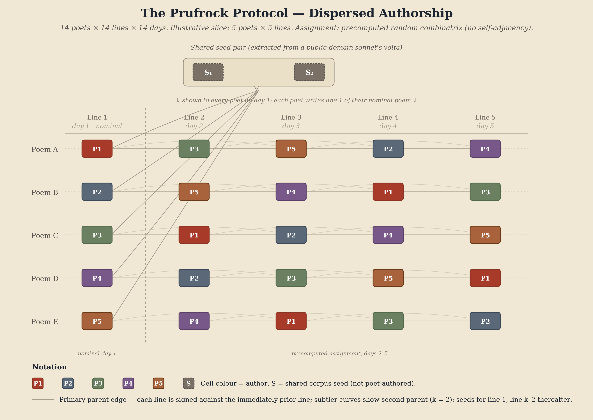

# The Protocol

The Prufrock Protocol is defined by five invariants, all of which are protocol constants — they hold across every instantiation, regardless of domain or medium:

1. **Interrupts.** The protocol reaches into a participant's ongoing experience at a moment not of their choosing (only a time window of their agreement). The interruption is the protocol's temporal anchor: it binds the contribution to a specific moment in a specific life.

2. **Confronts.** The interruption carries a payload: a prior contribution from someone else in the network. The participant does not respond to a blank prompt. They are confronted with a prior authenticated moment — an antithesis against the thesis of their present experience.

3. **Records.** The participant's response is captured as a signed contribution that includes the timestamp and geolocation. The contribution artefact becomes a compressed representation of the participant's outer context and inner consciousness in that moment.

4. **Authenticates.** Every contribution is cryptographically signed and hash-chained to its parents. The signature binds content to identity; the timestamps bind it to a moment; the geolocation binds it to a place; the parent hashes bind it to lineage. Together, these produce a contribution that is not merely stored but *situated* — authenticated not just as "from someone" but as "from this person, here, now, in response to that."

5. **Preserves lineage.** Each contribution commits to specific ancestors via cryptographic hash reference. The result is a directed acyclic graph of authenticated moments — a structure in which every node knows its parents and any tampering with an ancestor invalidates every descendant. The graph is the protocol's durable memory; it cannot be revised.

These five invariants define what makes something a Prufrock interaction. Everything else is parameterised.

## For Protocol Theorists

The Prufrock Protocol is small, fully specified, parameterised, and simulatable. It is a protocol that can actually be implemented and studied — distinguishing it from the usual examples in protocol theory (climate treaties, blockchain governance) that are too large to experiment with.

It offers several contributions to protocol theory proper:

The **compression-fidelity trade** names a property every protocol possesses but few make explicit: the relationship between what a protocol records and what it must discard. Prufrock's contribution tuple — seven fields per contribution — is a compression specification. The unrecorded remainder is the protocol's negative space. This trade can be analysed, compared across protocols, and potentially nondimensionalised.

**Negative space as design category** inverts the usual analytical frame. Protocol theory studies what protocols do — their rules, states, transitions, observables. Prufrock introduces a formal concept for what protocols *don't do* and argues this is equally important. The unrecorded dimensions of an interaction are the space in which participants exercise judgement, agency, and meaning-making. A protocol's negative space may determine its susceptibility to drift: too large, and participants fill it with uncoordinated practices that diverge; too small, and the protocol becomes brittle.

**Aesthetic enforcement** names a class of constraint with no enforcement mechanism in the traditional sense but enormous structuring power. A sonnet's rhyme scheme or a ghazal's radif are not enforced by punishment, consensus, or cryptography. They are enforced by visible commitment — violations are apparent to subsequent participants through the stigmergic surface of the poem-in-progress. This is coordination without consensus, and it may generalise beyond aesthetic domains.

**Situated authentication** extends authentication from binding content to identity to binding content to a specific moment and place. Most protocols authenticate *actions*. Prufrock authenticates *situated moments of human experience* — the fact that a specific person, in a specific place, at a specific time, was confronted with another's expression and responded.

## Protocol and Experiment

The Prufrock Protocol is parameterised. Its formal specification distinguishes **protocol constants** [P] from **experiment variables** [E]: the constants define the protocol's identity; the variables define a specific instantiation.

The constants are structural: the signature scheme (Ed25519), the hash function (SHA-256), the clock domain (UTC), geographic resolution (H3 level 5), append-only ledger structure, self-exclusion (you are never prompted with your own work), prompt anonymity (you respond to contributions, not to people), and forfeit recording (absence is data — the ledger does not pretend silence didn't happen).

The variables are configurational: cohort size, response window, response medium (text, audio, image, video, mixed), response unit, prompt depth, interruption timing, selection rule, form constraints, seed source. A specific combination of these variables defines an **experiment** — a concrete instantiation of the protocol with a defined population, duration, and output form.

This separation matters. It means the protocol can be studied as a formal object independent of any particular experiment, while experiments can be compared as points in a shared parameter space. It also means the protocol can migrate across domains without losing its identity: a Prufrock experiment using sonnets and a Prufrock experiment using field recordings of birdsong satisfy the same five invariants and produce the same kind of authenticated, lineage-preserving record.

## Example Experiment

## Draft Formalisation

See: [Draft Formalisation](formalisation.md)