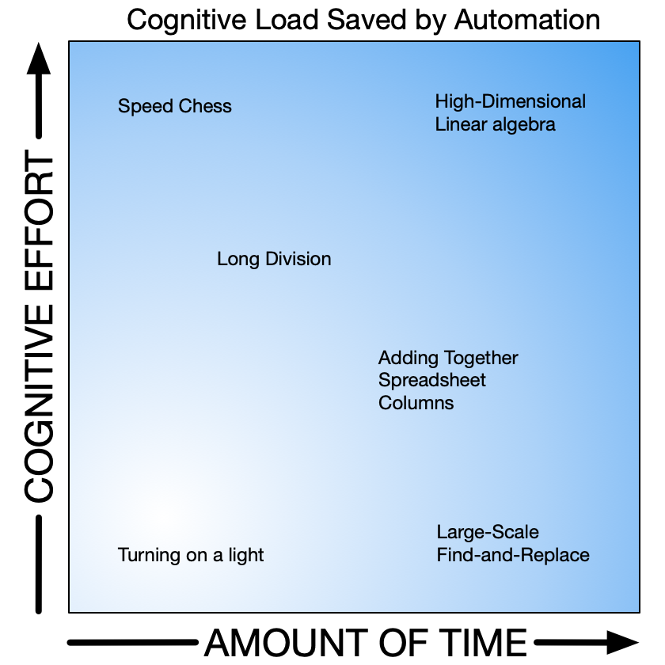
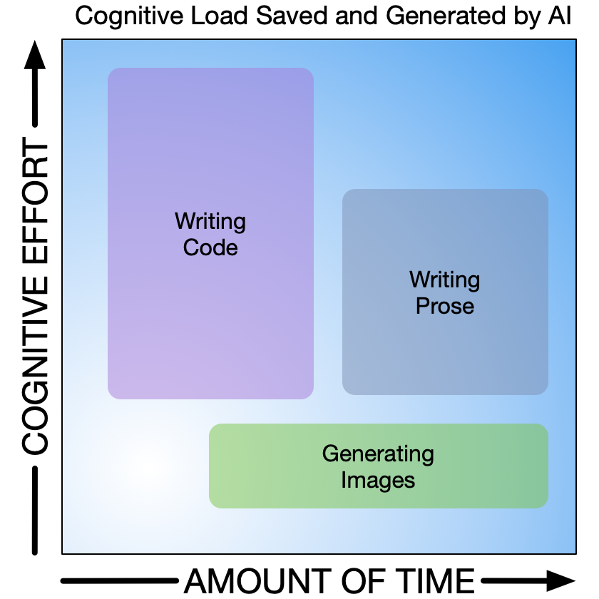
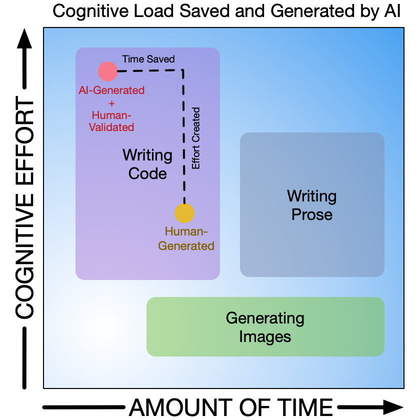
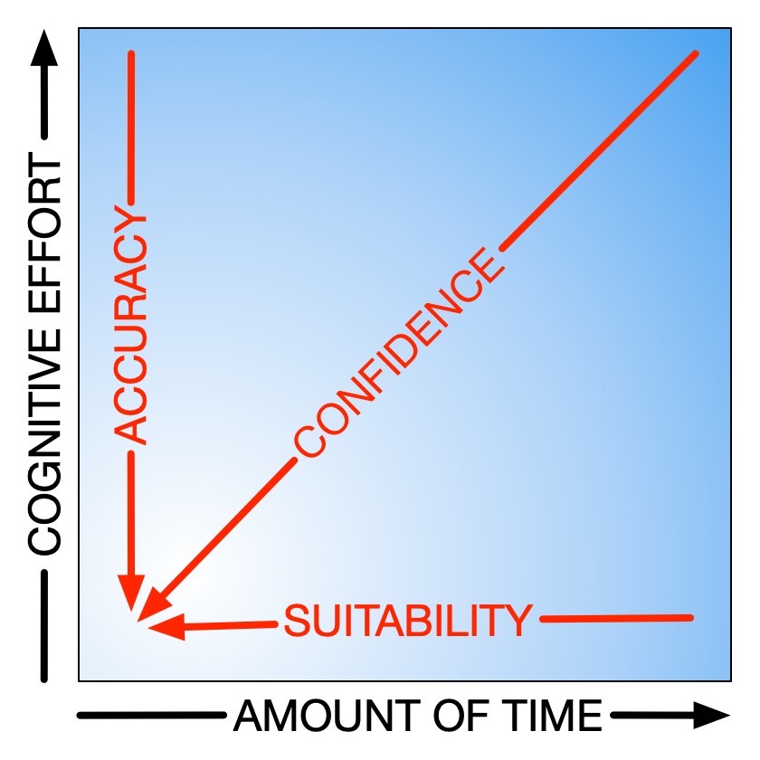

# The Cognitive Cost of AI

What's underneath the productivity gains, and what it costs to stay in control of our own thinking.

---

An update of a [2023 essay](https://www.robertpeake.com/archives/102992-the-hidden-cost-of-cyborg-working.html), rewritten for the agentic-AI era.*

---

AI is set to teach us more about how our own brains work — but not in the way you might expect.

Generative AI is already automating intellectual activity. The benefits and drawbacks are becoming more obvious and stark, but amid all the debate about whether machines are intelligent, a key component seems to be missing from the conversation: the impact on our own dear minds.

> **Productivity isn't the story. Effectiveness is.** And if your definition of "effectiveness" doesn't include the human, you're cooked.

The benefits of automation are usually stated in terms of time — because time is money, and work is a financial activity. But truly high-performing individuals and teams know that time is only one factor to manage. Alongside the growing awareness of mental health, a parallel idea has been emerging in science and psychology: cognitive load.

In knowledge work, cognitive load is money, too. Faced with a stream of decisions, a mentally tired worker is a less effective worker — and their resourcefulness and judgement matter as much as, if not more than, the sheer hours they put in behind a screen.

Since cognitive load is just cognitive effort over time, it helps to separate the two dimensions. Earlier waves of automation have been saving us time and effort for decades. A simple plot:

*Pre-AI automation, mapped against time saved and effort saved.*

## Three Years Ago, An Experiment

In 2023, I undertook three activities as a "transhuman" — one part AI to generate the content, one part person to validate the result -- using traditional LLM prompting. The amount of time and effort the AI saved, set against the time and effort it cost me to supervise and validate, varied considerably:

*Three transhuman activities: generating images, writing prose, writing code.*

The problem saw then, and foresee ever more in "transhuman" (human + AI) co-working is the extent to which our obsession with speed will produce a false economy — and perpetuate an epidemic of burned-out knowledge workers making bad decisions.

Here was my experience in 2023 co-writing code:

*Time saved on the keystrokes; cognitive effort created in the review.*

## What (Hasn't) Changed, Just Accelerated

Now in 2026, with the rise of agentic coding, what was a copy-and-paste loop through every major has become far more autonomous. AI is dispatching to AI, asking itself the kinds of strategic and tactical questions I used to have to ask, and iterating -- sometimes for thirty minutes or more -- on a task using powerful text editing tools. Watching it "think" is not unlike listening to my own inner monologue as I go about a similar task.

Yet it still goes off the rails, makes stuff up, writes bugs.

So how do we navigate even more power handed to us alongside even more compound uncertainty?

> **Validation is the new super-skill.**

I recommend the same safeguards most large, mixed-experience teams already impose: automated regression testing, code reviews, and extensive documentation. All of this helps the AI loop faster with less human tending.

But tending is still required. And when agents run in parallel, their constant "pings" — for permission to run an obscure Perl command, for a high-level architectural decision — compress what was a senior team lead's *days* into *hours*. It can quickly blow your circuits.

## Staying Sane as a Transhuman

Three forces are now visible in transhuman work, and they're worth naming: **cognitive load** (what we carry), **cognitive sovereignty**[+] (what we keep), and **cognitive debt** (what we owe to our future selves).

Cognitive sovereignty — staying in control of the final decision — can be elusive when working alongside a partner that's truly convincing and has zero real-world experience. The decision, and the responsibility for it, still need to stay with you.

Ceding cognitive sovereignty leads to cognitive debt. Borrowed from the software world — where the gap between today's code and today's best practice widens silently — cognitive debt simply means you failed to follow the workings-out along the way to the result. It's like using a calculator without knowing how to do arithmetic. It doesn't just lead to dependence; it robs you of essential context.

And given that AI needs context to do meaningful work, if we can no longer supply it, both sides of the transhuman equation collapse.

## Manage or be Managed

Coming back to basics, the factors that govern the real power of AI output are three: how accurate it is, how suitable it is, and how much confidence we can have in it as a result.

*Accuracy, suitability, confidence — and the cognitive effort required to assess each.*

Generative AI is a cocktail of statistics and internet data — anything it mixes up needs to be checked, followed, and overridden when wrong. Because its results are statistical, "100% accurate" will never be on the cards. And because its power lies in consuming large data sets, all the caveats of information gathered from open sources on the internet apply.

> **Validation is the new super-skill.**

And validation takes not only subject-matter expertise but meta-awareness — of your own limitations, and of the AI's.

There is tremendous promise ahead for our AI-agent-enhanced transhuman lives — the same promise as traditional automation: greater output, less grunt work. All the same socio-economic perils apply to this revolution as did to the industrial one. But unlike past waves of automation, this one is going to hit us where we live — our minds.

Continually evaluating what these vast, naive thinking partners are doing to our own minds will be the skill that lets us survive and thrive as transhumans. With each output, we must ask: *Is it accurate? Is it fit for purpose? Is "good enough" really good enough in this case?*

Mind your mind in the era rapidly unfolding before us. You can't just fix it by turning it off and on again.

--

+ - thanks to the Artificiality Institute for introducing me to the term "cognitive soverignty". For more great thinking on humane transhumanism, I highly their [YouTube shorts](https://www.youtube.com/@Artificiality/shorts) in particular.
